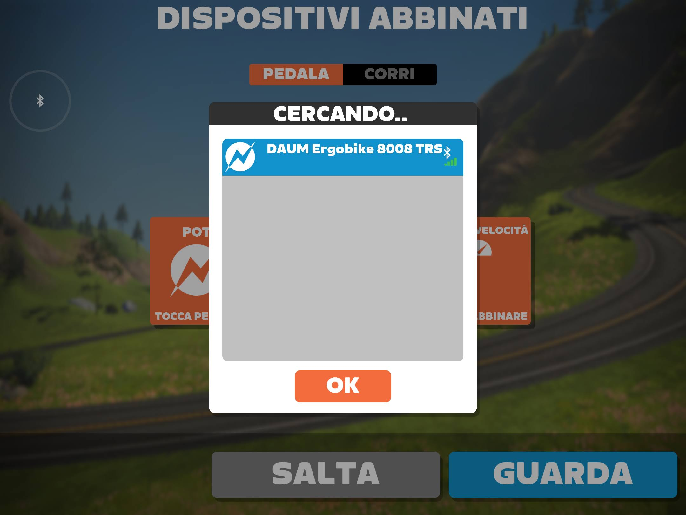

# ergoFACE 2023
forked from https://github.com/weinzmi/daumUSB2BLE 

Identical to the original code but,
* modified fitness-control-point-characteristic.js as ZWIFT was not controlling anymore,
* modified daumUSB.js to be compatible with newer "serialport" versions as I was not able to install v3.1.2 used in the original project, and
* added a step-by-step guide from "empty micro sd-card" to "ZWIFT working" for people like me not very skilled with the raspberry pi world.
I have tried the whole sequence on an empty sd-card and it was working.

Many thanks [weinzmi](https://github.com/weinzmi/daumUSB2BLE) and [360manu](https://github.com/360manu/kettlerUSB2BLE) for the idea and the working code

# Step by Step Setup Guide

## HARDWARE needed:
1. Raspberry PI zero W  (likely other models are also working) + micro usb supply + micro sd card

2. Ergometer DAUM 8008. Depending on how much rust is on it, it cost between 100 and 300€
3. USB-A to micro-USB converter to connect to the rasperry pi zero w
4. USB to RS232 (male) converter with original FTDI chip
5. RS-232 modified cable. NOT NEEDED IF the ergo-bike is TSR-3. For all other models it is needed
   * 1x cheap rs 232 cable,
   * two break out plugs (one male ,one female),
   * resistor 4.7kOhm (to be used in the female break out plug),
   * see the connections [scheme](https://bikeboard.at/forum/topic/1564-schnittstellenkabel-rs-232-an-pc/#comment-2424750)


To set up the raspberry pi you do not need the bike. So I would first start with the Raspberry (1) and only when it is working properly move to points (2) to (5) and buy the bike.

Some models of the DAUM 8008 are supposed to work with a normal RS 232 cable, I would give first a try before modifying it.

## Setting up the Raspberry Pi

### Install Instructions
Use the [imager](https://www.raspberrypi.com/software/) to prepare the micro SD card. I have selected:
* Operaing System: RASPBERRY PI OS LITE without UI (32-bit)
* In the settings define:
  * a name for the host e.g. "ergoface", 
  * the user name. This MUST be "pi".  Set a password you like to connect,
  * set up the WLAN to connect later on with SSH. (your home WIFI SSID and password)

Once the PI is up and running connect ssh to it. On a mac open Terminal and type:
```shell
ssh pi@ergoface.local
```

Enable the serial port
```shell
sudo raspi-config
```  
Go to point 3, then to serial interface.  Answer the first question witn NO and the second with YES.
Right arrow until "Finish", when you press enter the system will reboot.

After a couple of minutes connect again ssh to the raspberry.

Set up the bluetooth according to bleno instructions:
```shell
sudo systemctl stop bluetooth
```
```shell
sudo systemctl disable bluetooth
```
```shell
sudo apt-get install bluetooth bluez libbluetooth-dev libudev-dev libusb-1.0-0-dev
```
```shell
sudo reboot
```
Connect again ssh to the raspberry.

Set up node.js. I have used version 10.24.1
```shell
wget https://nodejs.org/dist/v10.24.1/node-v10.24.1-linux-armv6l.tar.gz
```
```shell
tar -xf node-v10.24.1-linux-armv6l.tar.gz
```
```shell
sudo mv node-v10.24.1-linux-armv6l /usr/local/node
```
```shell
cd /usr/bin
```
```shell
sudo ln -s /usr/local/node/bin/node node
```
```shell
sudo ln -s /usr/local/node/bin/npm npm
```
```shell
cd /home/pi
```

Downolad the program from GitHub (you might need to install git ..."sudo apt-get update" + "sudo  apt install git")
```shell
git clone https://github.com/lignazio71/daumUSB2BLE.git
```
Install all dependencies and the program
```shell
cd daumUSB2BLE/
```
```shell
source installPackages.sh 
```
It will take roughly 1 hour to complete. It will install all the packages with the exact version that was working for me.

To try if it is working
```shell
sudo node server.js 
```
After one minute you should see in the shell
```shell
pi@ergoface:~/daumUSB2BLE $ sudo node server.js 
[daumBLE.js] - DAUM Ergobike 8008 TRS - BLE server starting
[daumBLE.js] - DAUM Ergobike 8008 TRS - new state: poweredOn
[daumBLE.js] - DAUM Ergobike 8008 TRS - advertisingStart: success
[daumBLE.js] - DAUM Ergobike 8008 TRS - servicesSet: success
[daumBLE.js] - DAUM Ergobike 8008 TRS - setServices: success
```
Now you can try to connect with zwift. When you try to connect a sensor it should print in the shell
```shell
[daumBLE.js] - DAUM Ergobike 8008 TRS - accept - Client: 42:ed:ed:e1:c3:4c
[daumBLE.js] - DAUM Ergobike 8008 TRS - rssiUpdate: -58
[FitnessControlPoint] onSubscribe
```

When I was searching for the power sensor:



After all 3 sensors have been connected:


### Automatic start at power up
Execute these commands as described in [360manu](https://github.com/360manu/kettlerUSB2BLE) 
```shell
sudo systemctl link /home/pi/daumUSB2BLE/lib/systemd/system/ergoFACE.service 
```
```shell
sudo systemctl enable ergoFACE.service
```
```shell
 sudo systemctl start ergoFACE.service
```
Restart the Raspberry PI, the service should start automatically and in case of failure it should restart
```shell
sudo reboot
```

### Setting on the ergo-bike
I set the ergo-bike in manual mode (Program 0). When zwift is not controlling the bike sets the power to 25W

You can use the wheel to change gear in simulation mode.

### Working/Not Working
I have tried and it was recognized by these apps
* Zwift - works both ERGO and simulation
* MyWhoosh - works in ERGO, not in simulation
* Whaoo RGT - works in ERGO, not in simulation
* Trainer Day - works in ERGO

The command for simulation mode must be slightly different between zwift (working) to other apps (not working) ... it would need some debug

I have tried wo success 
* to detect it with my Garmin Watch but it did not work

The ergo-bike can set the power in steps of 5W. For training in ergo mode is perfect.
In simulation mode it feels a bit slow in reacting to the slope changes of the road. 
Changing gear is aslo a bit slow but on the other hand you can change many gear steps at once, much faster than on a real bike.

## Enjoy it !
--------------------------------------------------------------------

## Settings
Some notes I left from the original description of [weinzmi](https://github.com/weinzmi/daumUSB2BLE):


## Configuration for simulation mode
* if SIM mode is a feature you want to use, edit the parameters in config.yml to fit yours
```
simulation:
    maxGrade: 16 // maximum grade, higher than this, will be cut
    mRider: 78 // weight of you, the rider
    mBike: 9 // weight of your bike

gearbox: // this are the gear ratios used for each gear
    g1: 1.36
    g2: 1.48
    g3: 1.62
    g4: 1.79
    g5: 2.00
    g6: 2.17
    g7: 2.38
    g8: 2.63
    g9: 2.94
    g10: 3.33
    g11: 3.57
    g12: 3.85
    g13: 4.17
    g14: 4.55
```
These parameters influence how much power is applied to the ergo-bike according to the conditions provided by zwift (speed/slope/wind).

## GIOPs for shifting gears
* if you want to use 2 external buttons for shifting gears, edit the parameters in config.yml to fit yours
```
gpio:
    geargpio: 1 // start gear for initializing
    ratio: 1 // how many gears are shifted with one push of a button
    minGear: 1 // lowest gear possible
    maxGear: 14 // highest gear possible; has to match gearbox
    debounceTimeout: 10
    shiftUpPin: 4 // GPIO pin for shift up
    shiftDownPin: 17 // GPIO pin for shift down
```

## website / server (not tested)
* start your browser and enter "pi-adress:3000" (try to get fixed IP address for you raspberry on your router before)
you can follow the ergoFACE activity on a this website.
It will display the current power, rpm, speed
the current gear and program your Daum is running and the socket messages.
This site is used to toggle between ERG and SIM mode and toggle between switching gears or just power
### you can use the server to:
* see current data from Daum Ergobike
* see power calculation (simulation), grade (slope), Cw (aerodynamic drag coefficient)
* see current program & gear
* stop / restart RS232 interface via server
* select gears
* select program
* toggle set Power / switch gears
* toggle socket messages - key / raw / error
